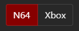

# Twitch.tv Speedrunner Bot
#### "Speedrunner_Bot"
A bot for Twitch.tv with speedrunner-specific functionality and Speedrun.com API integration, written in Python.

## Index
1. [What Can This Bot Do?](#what-can-this-bot-do)
2. [Bot Commands](#bot-commands)
3. [How to Set Up the Bot](#how-to-set-up-the-bot)
4. [How to Run and Use the Bot](#how-to-run-and-use-the-bot)

## What Can This Bot Do?
- Tell a user the world record for the game & category you are running (or, a specified category)
- Tell a user the second, third, or fourth place time for the game & category you are running (or, a specified category)
- Tell a user your personal best time for the game & category you are running
- Tell a user the personal best time of a specified Speedrun.com user for the game & category you are running
- Create a Speedrun.com link to the leaderboard for the game & category you are running
- Create a kadgar.net race link with you and other speedrunners (if you are currently racing) 

## Bot Commands
- `!wr [optional_category]` (everyone)
    - Returns the world record (time and runner) for the game & category specified in your stream title (or, the specified category). Data is taken from the [speedrun.com](https://www.speedrun.com/) API in realtime.
- `!2nd [optional_category]` (everyone)
    - Returns the 2nd place time and runner for the game & category specified in your stream title (or, the specified category). Data is taken from the [speedrun.com](https://www.speedrun.com/) API in realtime.
- `!3rd [optional_category]` (everyone)
    - Returns the third place time and runner for the game & category specified in your stream title (or, the specified category). Data is taken from the [speedrun.com](https://www.speedrun.com/) API in realtime.
- `!4th [optional_category]` (everyone)
    - Returns the fourth place time and runner for the game & category specified in your stream title (or, the specified category). Data is taken from the [speedrun.com](https://www.speedrun.com/) API in realtime.
- `!pb [optional_user]` (everyone)
    - Returns your personal best (or, the personal best of a specified user) for the game & category specified in your stream title. Data is taken from the [speedrun.com](https://www.speedrun.com/) API in realtime.
- `!leaderboard` (everyone)
    - Creates a [speedrun.com](https://www.speedrun.com/) link to the leaderboard for the game & category specified in your stream title.
- `!race` (everyone)
    - Creates a [kadgar.net](http://kadgar.net) link with you and your opponents' streams (if you are currently racing).
- `!commands` (everyone)
    - Returns a list of bot commands.
- `!kill` (channel owner only)
    - Quits the bot program.
    
## How to Set Up the Bot
1. Install the latest version of Python 3 ([here](https://www.python.org/downloads/))
2. In the *Settings.py* file, enter the required information in the following fields under `# Channel owner settings`:
    - **CHANNEL**: *The channel owner's Twitch username.*
    - **CHANNELPASS**: *The oauth token for the channel owner's Twitch account — get one [here](https://twitchapps.com/tmi/) while logged into the channel owner's Twitch account.*
    - **GAMES**: *Add, as a Python list, the game(s) you speedrun to this list. If you only speedrun one game, it should be a list with only one list inside. For each game's list, the first element should be the name of the game exactly how you'd type it in your stream title. The second element should be the code for the game that Speedrun.com uses in the hyperlink for that game's page. For example, Banjo-Tooie is 'bt'*:  
      
    *The third element should be the name of the platform that game is played on. For example, 'Nintendo 64'. The fourth element should be that platform's code as displayed on Speedrun.com. For example, Nintendo 64 is 'N64'*:  
    
    - **CATEGORIES**: *Add, as a Python list, the categorie(s) of all the games you speedrun to this list. If you only run one category, it should be a list with only one list inside. For each category's list, the first element should be the name of the category exactly how you'd type it in your stream title. The second element should be the code for that category that Speedrun.com uses in the hyperlinks for that category. For example, Any% is usually 'Any' and 100% is usually '100'*:  
    
     - **SRC_USERNAME**: *If your Speedrun.com username is different from your Twitch username, change this to your Speedrun.com username (within quotes and lowercase). Otherwise, leave this unchanged.*

### [Optional] If you want the bot to control a Twitch account other than Speedrunner_Bot:
3. In the *Settings.py* file, also edit these two fields under `# Bot account settings`:
    - **PASS**: *the oauth token for the Twitch account that will be controlled by the bot — get one [here](https://twitchapps.com/tmi/) while logged into the bot's Twitch account*
    - **IDENT**: *the username of the Twitch account that will be controlled by the bot*

## How to Run and Use the Bot
Run the *Run.py* file every time you stream and the bot will join your channel, ready to be used!  

The speedrunning-specific features take your stream title into account. So, for the WR checker/PB checker/leaderboard link generator/race link generator to work, please adhere to these guidelines when making your stream titles:
- Write the game title exactly as you wrote it in the *Settings.py* file.
- Write the category title exactly as you wrote it in the *Settings.py* file.
- If you're doing a race, make sure "race with" is at the very end of your title, followed by your opponents' Twitch usernames separated by commas. For example: "Banjo-Tooie Any% Race with coolguy123, speedrunner456, streamerdude11". Do not use "and". Only commas.

  
Note: *It is recommended that you make Speedrunner_Bot a moderator in your channel, so that it isn't accidentally timed out/banned/etc. by other bots and/or moderators.*

## To Do List
- [ ] Add a GUI to run the bot from a single .exe, add dropdown lists for settings, etc.
- [ ] Host the bot online as opposed to locally
